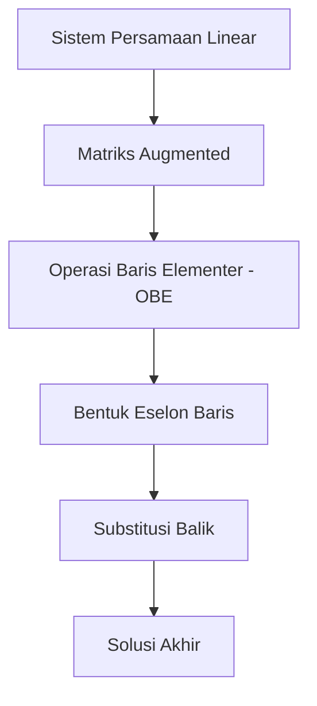
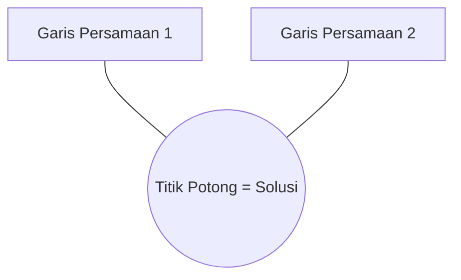

# Sistem Persamaan Linear (SPL)

## Tujuan Pembelajaran
Setelah mempelajari materi ini, Anda diharapkan mampu:
- Membedakan persamaan linear dan non-linear dengan tepat.
- Menentukan apakah suatu persamaan linear bersifat homogen atau tak-homogen.
- Menyusun sistem persamaan linear ke dalam bentuk matriks augmented.
- Menerapkan Operasi Baris Elementer (OBE) untuk mencari solusi sistem persamaan linear.

## Prasyarat
Sebelum memulai, pastikan Anda telah memahami:
- Konsep dasar aritmatika (penjumlahan, pengurangan, perkalian, pembagian).
- Pengenalan dasar tentang matriks (baris, kolom, dan elemen matriks).

---

## Bagian 1: Gambaran Besar

### Analogi Timbangan Neraca Dua Lengan
Persamaan linear dapat dianalogikan seperti timbangan neraca dua lengan yang seimbang.
- Lengan kiri berisi beban variabel dan konstanta.
- Lengan kanan berisi beban konstanta hasil akhir.
- Timbangan harus selalu seimbang. Jika Anda menambah atau mengurangi beban di lengan kiri, Anda harus melakukan hal yang sama di lengan kanan.

Sistem Persamaan Linear (SPL) adalah ketika Anda memiliki beberapa timbangan sekaligus dengan jenis beban variabel yang sama, dan Anda bertugas mencari berat dari masing-masing jenis beban variabel tersebut.

### Diagram Overview Alur SPL
Berikut adalah alur penyelesaian SPL menggunakan matriks:



---

## Bagian 2: Konsep Inti

### Definisi Singkat SPL
Sistem Persamaan Linear adalah kumpulan dari satu atau lebih persamaan linear yang menggunakan variabel-variabel yang sama.

### Contoh Konkrit

#### Perbandingan Persamaan Linear dan Non-Linear

Contoh persamaan linear:
$$
2x + 3y = 6
$$

$$
\sqrt{5}x - 2y = 8
$$

Contoh persamaan non-linear:
$$
x^{2} + y^{2} = 1
$$

$$
xy = 4
$$

$$
\sin(x) + y = 2
$$

#### Perbandingan Persamaan Homogen dan Tak-Homogen

Contoh persamaan homogen:
$$
3x - y = 0
$$

Contoh persamaan tak-homogen:
$$
3x - y = 5
$$

### Visualisasi Geometris Solusi SPL (2D)
Secara geometris, solusi dari SPL 2 dimensi adalah titik potong dari garis-garis persamaan tersebut:



### Latihan Kecil
Tentukan jenis persamaan berikut (Linear/Non-linear dan Homogen/Tak-homogen):

1.
$$
x - 5y = 0
$$

2.
$$
x + yz = 3
$$

3.
$$
2x + y = 9
$$

---

## Bagian 3: Detail / Teknis

### Indeks Ganda Koefisien
Untuk sistem persamaan dengan banyak variabel, koefisien dilambangkan dengan indeks ganda:
$$
a_{ij}
$$

Keterangan:
- Indeks pertama menunjukkan nomor baris (persamaan).
- Indeks kedua menunjukkan nomor kolom (variabel).

### Matriks Augmented (Membentuk Matriks Diperbesar)
Misalkan kita memiliki SPL berikut:
$$
2x + y + z = 8
$$

$$
3x - y - z = 2
$$

$$
x + 2y - z = 2
$$

Matriks augmented dari SPL di atas adalah:
$$
\begin{bmatrix}
2 & 1 & 1 & | & 8 \\
3 & -1 & -1 & | & 2 \\
1 & 2 & -1 & | & 2
\end{bmatrix}
$$

### Operasi Baris Elementer (OBE)
Operasi Baris Elementer adalah langkah manipulasi baris matriks tanpa mengubah nilai solusinya. 3 aturan OBE adalah:
1. Menukar posisi dua baris.
2. Mengalikan sebuah baris dengan konstanta bukan nol.
3. Menambahkan kelipatan suatu baris ke baris lainnya.

### Langkah demi Langkah OBE (Eliminasi Gaussian)
Mari selesaikan matriks augmented di atas langkah demi langkah menggunakan Python NumPy.

```python
import numpy as np

# Definisikan matriks koefisien A dan konstanta b
A = np.array([[2.0, 1.0, 1.0],
              [3.0, -1.0, -1.0],
              [1.0, 2.0, -1.0]])

b = np.array([8.0, 2.0, 2.0])

# Menggunakan np.linalg.solve untuk mencari solusi secara langsung
solusi = np.linalg.solve(A, b)
print("Solusi variabel x, y, z adalah:", solusi)
```

### Edge Case / Catatan Penting
SPL tidak selalu memiliki solusi unik. Kemungkinan solusi SPL meliputi:
1. **Solusi Unik (Satu Solusi):** Garis-garis saling berpotongan di satu titik.
2. **Solusi Tak Terhingga:** Persamaan saling tumpang tindih (garis yang sama).
3. **Tidak Ada Solusi:** Garis-garis sejajar dan tidak pernah bertemu.

---

## Rangkuman
- Persamaan linear adalah persamaan dengan pangkat variabel tertinggi bernilai satu.
- SPL homogen memiliki ruas kanan bernilai nol, sedangkan tak-homogen tidak bernilai nol.
- Representasi SPL ke dalam bentuk matriks augmented mempermudah proses eliminasi menggunakan OBE untuk memperoleh bentuk eselon baris.

---

## Latihan / Soal
Selesaikan SPL berikut dengan metode eliminasi:
$$
x + y = 5
$$

$$
2x - y = 1
$$

---

## Referensi
- Anton, H., & Rorres, C. (2013). Elementary Linear Algebra: Applications Version. John Wiley & Sons.
